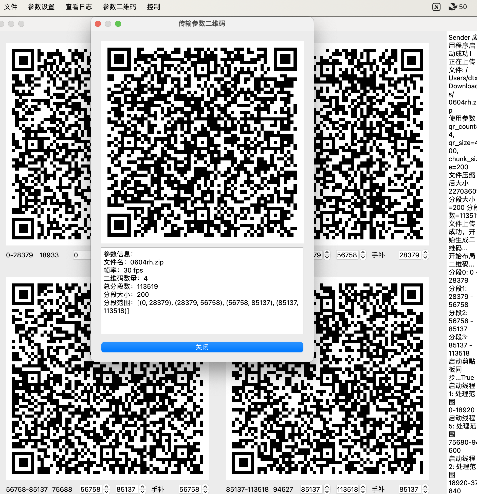
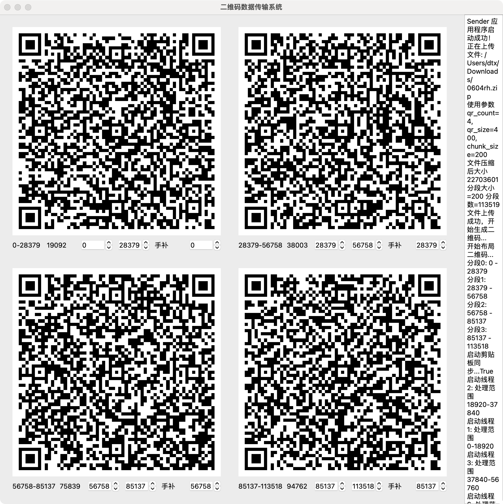
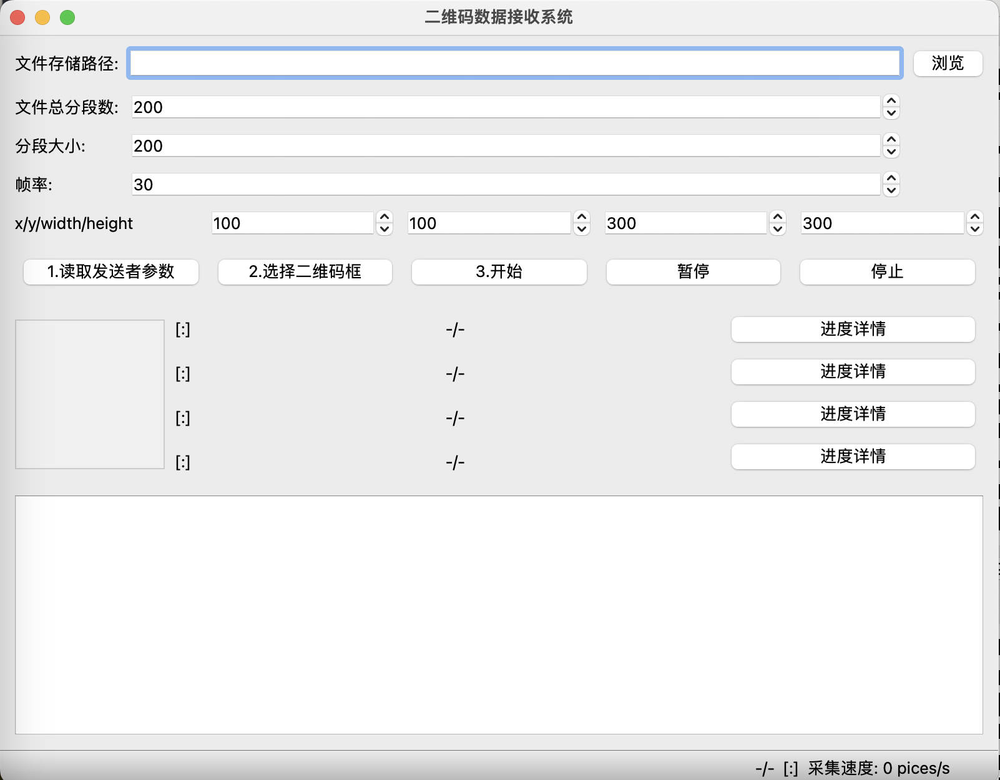
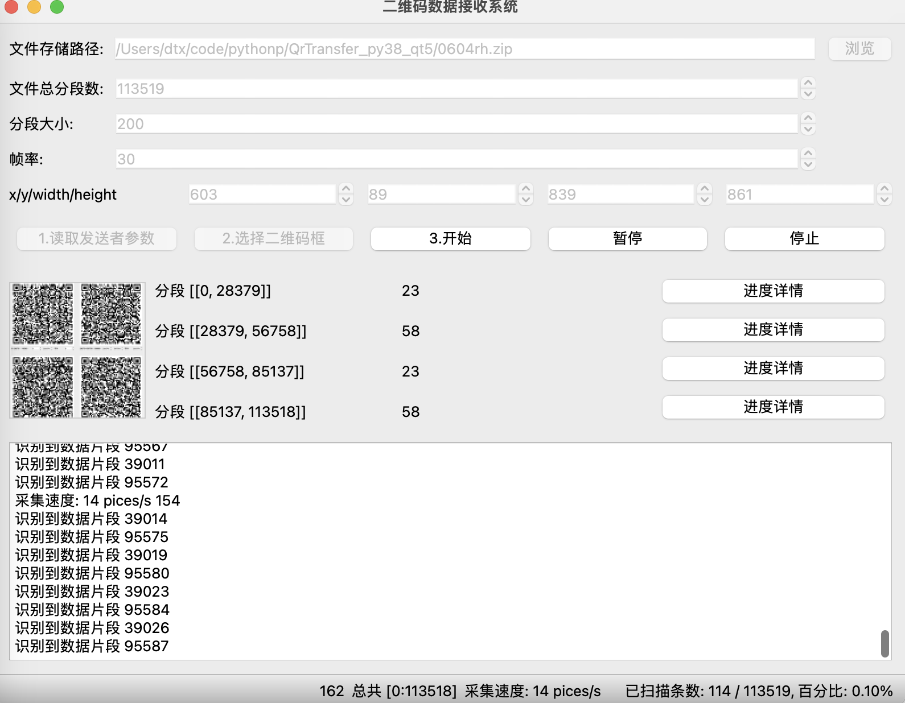

# QR Code Data Transfer System

一个基于二维码的数据传输系统，包含发送端和接收端两个应用程序。该系统可以将任意文件通过二维码序列的方式进行传输，支持多个二维码并行传输以提高传输效率。

本程序可用于从云电脑（云桌面）传输数据到本地电脑上。 因为在某些场景下会禁止从云电脑（云桌面）拷贝文件到本地电脑，使用本传输系统可以突破这一限制。 

在macbook pro m1上测试的传输速度约6kb/s。 

欢迎使用本程序，如果有任何问题或建议，欢迎提交issue。

## 功能特点
- 支持任意类型文件和任意大小文件的传输
- 支持1-4个二维码并行传输
- 实时预览和进度显示
- 可调节传输参数（帧率、数据分段大小等）
- 支持暂停/继续传输
- 支持错误检测和数据校验
- 云电脑（云桌面）可以单向读取本地电脑剪贴板，基于此实现接收端反馈读取结果给接收端 

## 效果图
### 发送端
打开发送端，点击菜单打开文件，选择一个文件，开始传输。 程序开始解析文件并显示参数二维码共接收端扫描。 
 
待接收端扫描完成参数二维码后，关闭参数二维码窗口。 

### 接收端
 

1. 点击读取发送者参数按钮，读取发送者参数二维码。 
2. 点击选择二维码框，选择二维码区域。 
3. 点击开始按钮，开始接收

注意：由于接收端是不断的截图发送端的二维码， 请注意传输过程中不要遮挡发送端页面； 在划定二维码区域后，不要移动发送端程序，确保接收端能正确截取到二维码。 
## 系统要求

- Python 3.8 , (pyqt5 支持windows7上运行)
- 操作系统：Windows/Linux/MacOS

## 依赖组件

主要依赖：

pip install pyqt5 pyzbar qrcode
pip install pyautogui
pip install opencv-python==4.5.5.64
pip install pillow==9.3
pip install pyperclip==1.9.0

On macOS and Linux, you need to run python3:

python3 -m pip install pyautogui
If you are running El Capitan and have problems installing pyobjc try:

MACOSX_DEPLOYMENT_TARGET=10.11 pip install pyobjc

## 安装说明

1. 克隆仓库：
git clone https://github.com/coodajingang/QrTransfer.git
cd QrTransfer

2. 安装依赖：
pip install -r requirements.txt

3. Windows系统需要额外安装zbar：
pip install zbar-py

## 使用说明

### 发送端 (gui.py)

1. 运行发送端程序：
python sender.py
2. 通过菜单栏"文件->打开文件"选择要传输的文件
3. 在"参数设置"中调整：
   - 帧率（1-100fps）
   - 二维码数量（1-4个）
   - 数据分段大小（1-2048字节）
   - 二维码大小（1-600像素）
4. 使用"控制"菜单进行开始/暂停操作

### 接收端 (rece_gui.py)

1. 运行接收端程序：
python receiver.py
2. 设置文件保存路径
3. 设置总分段数（与发送端一致）
4. 框选二维码区域（1-4个）
5. 点击"开始"按钮开始接收
6. 可以通过"暂停"/"继续"按钮控制接收过程

## 项目结构

- `gui.py`: 发送端主程序
- `rece_gui.py`: 接收端主程序
- `data_transfer.py`: 数据传输核心逻辑
- `qr_recognizer.py`: 二维码识别模块
- `recognition_thread.py`: 识别线程
- `file_handler.py`: 文件处理模块
- `selection.py`: 区域选择工具

## 注意事项

1. 确保发送端和接收端的分段数设置一致
2. 接收时需要保证二维码图像清晰可见
3. 较大文件建议使用多个二维码并行传输
4. 传输过程中避免遮挡二维码区域

## 许可证

MIT License

## 贡献

欢迎提交Issue和Pull Request

## 作者

coodajingang

## 更新日志

### v1.0.0 (2024-XX-XX)
- 初始版本发布
- 支持基本的文件传输功能
- 支持多二维码并行传输

